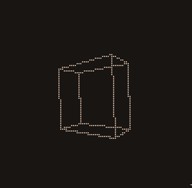

node-drawille
=============



Drawing in terminal with unicode braille characters.
The idea is based on [drawille](https://github.com/asciimoo/drawille)
by @asciimoo.

## Install

```
$ npm install drawille
```

## Usage

See [examples](examples).

This module provides a very basic API only, for fancy things,
like drawing lines, use another module,
like [`bresenham`](https://github.com/madbence/node-bresenham).

[`drawille-canvas`](https://github.com/madbence/node-drawille-canvas) provides HTML5 Canvas API for drawille (WIP).

## API

#### Canvas(w, h)

Create a new canvas with the given dimensions.
`w` must be multiple of 2, `h` must be multiple of 4.

#### canvas.set(x, y)

Draw point on `canvas` at the given position.

#### canvas.unset(x, y)

Delete point on `canvas` at the given position.

#### canvas.toggle(x, y)

Toggle point on `canvas` at the given position.

#### canvas.clear()

Clear the whole canvas (delete every point).

#### canvas.frame()

Return the current content of `canvas`, as a newline-delimited
string. It uses braille characters to represent points,
so every line has length of `w/2`, and the string contains `h/4`
lines.

## Projects

- [`vtop`](https://github.com/MrRio/vtop) uses it to draw CPU and memory usage charts in the terminal
- [`datop`](https://github.com/maxogden/datop) uses it to draw [dat](https://github.com/maxogden/dat) statistics
- [`boscillate`](https://www.npmjs.org/package/boscillate) uses it to draw [`baudio`](https://github.com/substack/baudio) soundwaves in real-time

## License

MIT
